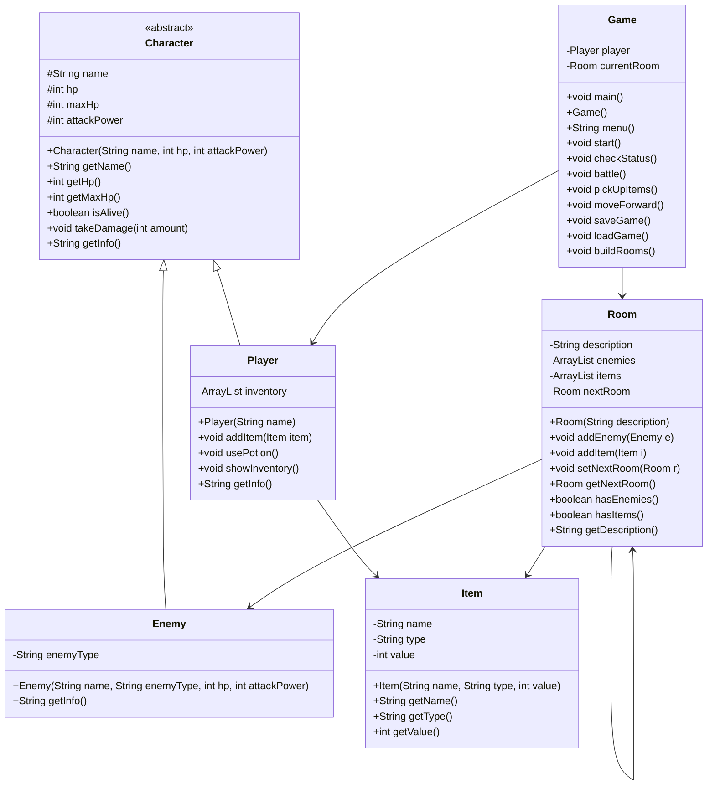

# Dungeon Crawler - Final Project Proposal

**Name:** Steven Houser  
**Course:** CS 121 - Data Structures & Objects  
**Date:** 04/03/26

---

## Project Summary

**Title:** Dungeon Crawler

**Description:** A text-based dungeon crawling game played through the command line, loosely inspired by the room-by-room loop in games like Slay the Spire. The player names their character and walks through a series of rooms, fighting enemies and picking up items along the way. Each room can have enemies to defeat and items to grab. The game saves progress to a file so you can quit and come back where you left off. I picked this because I wanted to build something I would actually enjoy playing, and the core loop of clearing rooms and building up a character fits well within everything we have learned this semester.

**Intended Users:** Me and anyone else who wants a simple CLI game with classic RPG mechanics. No install, no graphics, just run and play.

**Problem Solved:** I wanted a project that would pull together everything from the semester in a way that actually feels like a real program instead of just another banking system. Abstract classes, inheritance, ArrayLists, linked lists, and serialization all have a natural place in a dungeon crawler.

**Technologies and Structures:**
- Java, CLI only
- Abstract class (`Character`) with `Player` and `Enemy` extending it
- `ArrayList<Item>` for player inventory
- `ArrayList<Enemy>` and `ArrayList<Item>` per room
- Linked list pattern - each `Room` holds a `nextRoom` reference forming a chain
- Object serialization for save/load (`java.io.*`)
- No external libraries or dependencies

---

## Use Case Analysis

Sample session showing how the game plays from the command line:

```
What is your name? Steve

Welcome, Steve. Your adventure begins...

--- Dark Entrance ---
A damp stone corridor. Something moves in the shadows.

0) Check status
1) Fight
2) Pick up items
3) Move forward
4) Save and quit
Action: 1

A Goblin appears!
Steve attacks for 8 damage. Goblin HP: 7
Goblin attacks for 4 damage. Steve HP: 16
Steve attacks for 8 damage. Goblin HP: -1
You defeated the Goblin!

0) Check status
1) Fight
2) Pick up items
3) Move forward
4) Save and quit
Action: 2

You found: Health Potion (potion, value: 20)
You found: Rusty Sword (weapon, value: 5)
Items added to inventory.

0) Check status
1) Fight
2) Pick up items
3) Move forward
4) Save and quit
Action: 0

--- Steve ---
HP: 16 / 20
Attack Power: 8
Inventory:
  - Health Potion (potion, value: 20)
  - Rusty Sword (weapon, value: 5)

0) Check status
1) Fight
2) Pick up items
3) Move forward
4) Save and quit
Action: 4

Game saved. Goodbye, Steve.

--- Next session ---

Loading saved game...
Welcome back, Steve!

--- Dark Entrance ---
...
```

---

## Data Design

**What data does the program manage?**
- The player's name, HP, attack power, and inventory
- Enemies in each room (name, type, HP, attack power)
- Items in each room (name, type, value)
- Which room the player is currently in
- The full chain of rooms leading to the end

**How is it represented?**
- `Player` holds an `ArrayList<Item>` for the inventory
- Each `Room` holds an `ArrayList<Enemy>` and an `ArrayList<Item>`
- Rooms are linked using a `nextRoom` reference, forming a singly linked list the player walks through one room at a time

**Persistence:**
- The `player` object and `currentRoom` (which carries the rest of the room chain) are each saved separately to `savegame.dat` using `ObjectOutputStream`
- On startup the game tries to load them back with `ObjectInputStream`; if the file is not there it starts fresh
- All classes implement `Serializable`

**Data aggregation:**
- `Game` aggregates `Player` and the room chain
- `Room` aggregates `ArrayList<Enemy>` and `ArrayList<Item>`
- This mirrors the Bank project pattern - a controller class holds everything together

**Data Relationships:**



---

## OOP Paradigms Demonstrated

| Principle | Implementation |
|-----------|----------------|
| **Abstraction** | `Character` is abstract; `getInfo()` is declared but not defined there |
| **Inheritance** | `Player` and `Enemy` both extend `Character` |
| **Polymorphism** | `getInfo()` returns different output for Player vs Enemy |
| **Encapsulation** | All fields private or protected, accessed through getters/setters |
| **Aggregation** | `Game` holds `Player` and room chain; `Room` holds ArrayList of enemies and items |

---

## Algorithm / Class Design

---

### Item class

**Goal:** Represent a collectible item with a name, type, and value.

**Variables needed:**
- `name` - item name (String)
- `type` - "weapon" or "potion" (String)
- `value` - damage bonus or healing amount (int)

`Item(String name, String type, int value)`
- Set this.name, this.type, this.value

`getName()`
- Return this.name

`getType()`
- Return this.type

`getValue()`
- Return this.value

`main()` (test)
- Create a few sample items
- Print their info to verify getters work

---

### Character abstract class

**Goal:** Hold the shared stats and behavior for anything that fights.

**Variables needed:**
- `name` - character name (String)
- `hp` - current hit points (int)
- `maxHp` - maximum hit points (int)
- `attackPower` - base damage per attack (int)

`Character(String name, int hp, int attackPower)`
- Set this.name to name
- Set this.hp and this.maxHp to hp
- Set this.attackPower to attackPower

`getName()`
- Return this.name

`getHp()`
- Return this.hp

`getMaxHp()`
- Return this.maxHp

`isAlive()`
- Return true if hp > 0, else false

`takeDamage(int amount)`
- Subtract amount from hp
- If hp < 0, set hp to 0

`getInfo()`
- Declared abstract - subclasses must implement

---

### Enemy class

**Goal:** Represent an enemy the player can fight in a room.

**Variables needed:**
- (inherits name, hp, maxHp, attackPower from Character)
- `enemyType` - what kind of enemy, e.g. "Goblin" (String)

`Enemy(String name, String enemyType, int hp, int attackPower)`
- Call super(name, hp, attackPower)
- Set this.enemyType to enemyType

`getInfo()`
- Return a string with name, enemyType, and current HP

`main()` (test)
- Create a sample enemy
- Print getInfo() to verify

---

### Player class

**Goal:** Represent the player with an inventory of collected items.

**Variables needed:**
- (inherits name, hp, maxHp, attackPower from Character)
- `inventory` - list of items the player is carrying (ArrayList<Item>)

`Player(String name)`
- Call super(name, 20, 8)
- Create an empty inventory ArrayList

`addItem(Item item)`
- Add item to inventory

`usePotion()`
- Loop through inventory to find first item where getType() equals "potion"
- If found: add getValue() to hp, cap at maxHp, remove item from inventory, print result
- If not found: print "No potions available."

`showInventory()`
- If inventory is empty: print "Inventory is empty."
- Else: for each item in inventory, print name, type, value

`getInfo()`
- Return a string with name, current hp / maxHp, and attack power

`main()` (test)
- Create a Player
- Add a couple of items
- Print getInfo() and showInventory()

---

### Room class

**Goal:** Represent one location in the dungeon. Holds enemies, items, and a link to the next room.

**Variables needed:**
- `description` - room name and flavor text (String)
- `enemies` - enemies currently in this room (ArrayList<Enemy>)
- `items` - items sitting on the floor (ArrayList<Item>)
- `nextRoom` - the next room in the chain (Room)

`Room(String description)`
- Set this.description to description
- Create empty enemies and items ArrayLists
- Set nextRoom to null

`addEnemy(Enemy e)`
- Add e to enemies list

`addItem(Item i)`
- Add i to items list

`setNextRoom(Room r)`
- Set this.nextRoom to r

`getNextRoom()`
- Return this.nextRoom

`hasEnemies()`
- Return true if enemies list is not empty

`hasItems()`
- Return true if items list is not empty

`getDescription()`
- Return this.description

---

### Game class

**Goal:** The main controller. Handles the game loop, combat, navigation, and save/load.

**Variables needed:**
- `player` - the player character (Player)
- `currentRoom` - the room the player is currently in (Room)

`main()`
- Create new Game()

`Game()`
- Try to call loadGame()
- If load fails: prompt for player name, create new Player, call buildRooms()
- Call start()
- Call saveGame()

`buildRooms()`
- Create 5 rooms with descriptions
- Add enemies and items to each room
- Chain rooms together with setNextRoom()
- Set currentRoom to the first room

`menu()`
- Create a local Scanner
- Print blank line, current room description, blank line
- Print menu options (0 through 4)
- Only show Fight if room has enemies
- Only show Pick up items if room has items
- Only show Move forward if nextRoom is not null
- Prompt "Action: ", read and return response

`start()`
- Set keepGoing to true
- While keepGoing is true:
    - Call menu(), store result in response
    - If response equals "0": call checkStatus()
    - Else if "1": call battle()
    - Else if "2": call pickUpItems()
    - Else if "3": call moveForward()
    - Else if "4": set keepGoing to false
    - Else: print invalid input message

`checkStatus()`
- Print player.getInfo()
- Call player.showInventory()

`battle()`
- If room has no enemies: print "No enemies here." and return
- Get first enemy from room's enemies list
- Print enemy.getInfo()
- Set fightGoing to true
- While fightGoing is true:
    - Player attacks: call enemy.takeDamage(player.attackPower), print result
    - If enemy is not alive: print "You defeated [name]!", remove from list, set fightGoing to false
    - Else: enemy attacks: call player.takeDamage(enemy.attackPower), print result
    - If player is not alive: print "You were defeated. Game over.", exit

`pickUpItems()`
- If room has no items: print "Nothing to pick up." and return
- For each item in room's items list: call player.addItem(item), print item name
- Clear room's items list
- Print "Items added to inventory."

`moveForward()`
- If currentRoom.getNextRoom() is null: print "There are no more rooms. You win!" and exit
- Set currentRoom to currentRoom.getNextRoom()
- Print "You move into the next room."

`saveGame()`
- Try: open FileOutputStream to "savegame.dat", wrap in ObjectOutputStream
- Write player with writeObject(), write currentRoom with writeObject(), close both
- Catch Exception: print error message
- Print "Game saved."

`loadGame()`
- Try: open FileInputStream from "savegame.dat", wrap in ObjectInputStream
- Read player, read currentRoom, cast both, close streams
- Print "Loading saved game..."
- Catch Exception: print error message

---

## Milestone Plan

Each step leaves something that compiles and runs on its own:

1. UML approved - submit proposal, get feedback
2. `Item.java` - simplest class, test with `main()`
3. `Character.java` (abstract), `Enemy.java`, `Player.java` - test all three together
4. `Room.java` - add enemies/items, link rooms, test navigation
5. `Game.java` - bootstrap, `buildRooms()`, main menu loop (no combat yet)
6. `Game.battle()` - turn-based combat loop
7. `Game.pickUpItems()` and `Player.usePotion()` - inventory management
8. `Game.saveGame()` / `loadGame()` - serialization
9. Final testing and cleanup

---

## Build Instructions

*(To be added when code is written)*

- **Run:** `make run`
- **Clean:** `make clean`
