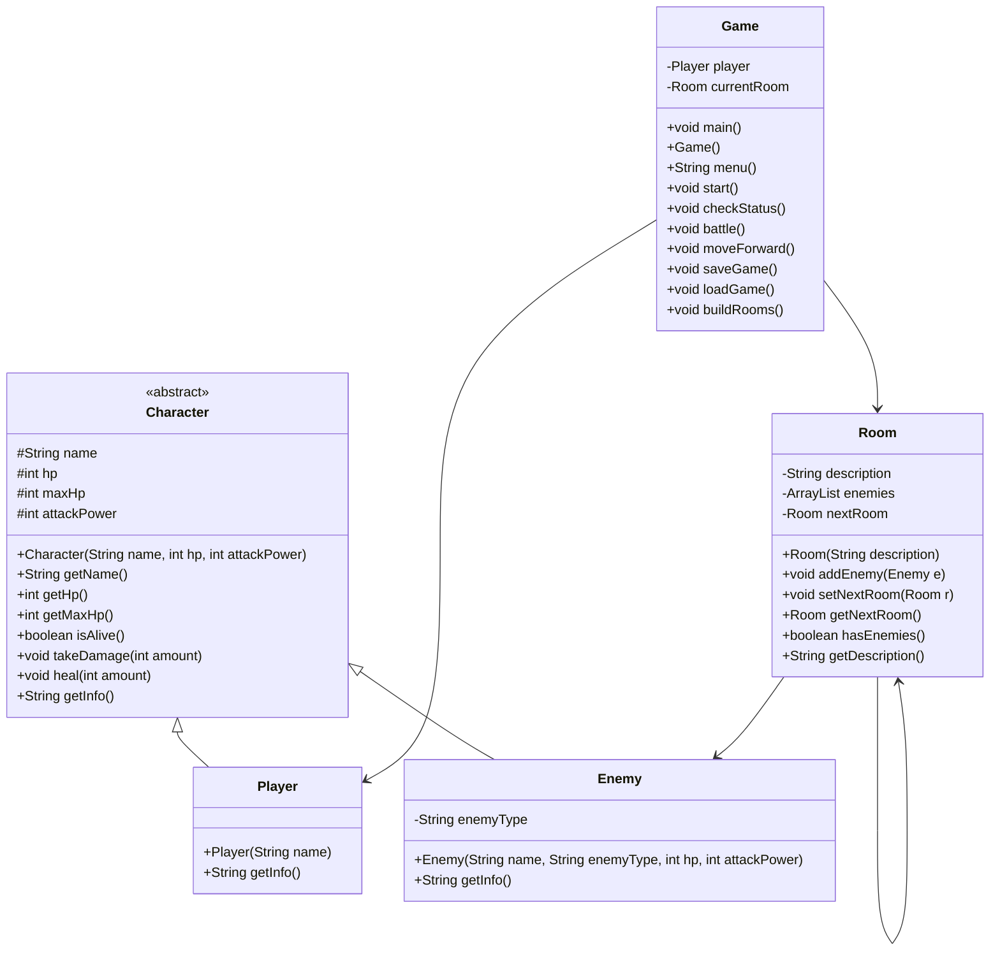

# Dungeon Crawler - Final Project

**Name:** Steven Houser  
**Course:** CS 121 - Data Structures & Objects  
**Date:** 04/27/26

---

## Project Summary

**Title:** Dungeon Crawler

**Description:** A text-based dungeon crawling game played through the command line, loosely inspired by the room-by-room loop in games like Slay the Spire. The player names their character and walks through a series of rooms in a fixed linear order, fighting enemies along the way. The game saves progress to a file so you can quit and come back where you left off. The core focus is getting the combat loop and room navigation working cleanly. Items and inventory are planned as stretch goals if time allows.

**Intended Users:** Me and anyone else who wants a simple CLI game with classic RPG mechanics. No install, no graphics, just run and play.

**Problem Solved:** I wanted a project that would pull together everything from the semester in a way that actually feels like a real program instead of just another banking system. Abstract classes, inheritance, ArrayLists, linked lists, and serialization all have a natural place in a dungeon crawler.

**Technologies and Structures:**
- Java, CLI only
- Abstract class (`Character`) with `Player` and `Enemy` extending it
- `ArrayList<Enemy>` per room
- Linked list pattern - each `Room` holds a `nextRoom` reference forming a linear chain
- Object serialization for save/load (`java.io.*`)
- No external libraries or dependencies
- Stretch: `Item` class with `damageModifier`/`hpModifier` fields, player inventory, item drops per room

---

## Use Case Analysis

Sample session showing how the game plays from the command line:

```
What is your name? Steve

Welcome, Steve. Your adventure begins...

--- Dark Entrance ---

0) Check status
1) Fight
2) Move forward
3) Save and quit
Action: 1

A Goblin appears!
Steve attacks for 8 damage. Goblin HP: 7
Goblin attacks for 4 damage. Steve HP: 16
Steve attacks for 8 damage. Goblin HP: -1
You defeated the Goblin!

0) Check status
1) Fight
2) Move forward
3) Save and quit
Action: 0

--- Steve ---
HP: 16 / 20
Attack Power: 8

0) Check status
1) Fight
2) Move forward
3) Save and quit
Action: 3

Game saved. Goodbye, Steve.

--- Next session ---

Loading saved game...
Welcome back, Steve!

--- Dark Entrance ---
...
```

---

## Data Design

**What data does the program manage?**
- The player's name, HP, and attack power
- For each room: a one-line name (shown in the header) and any enemies
- Enemies in each room (name, type, HP, attack power)
- Which room the player is currently in
- The full chain of rooms leading to the end

**How is it represented?**
- Each `Room` holds an `ArrayList<Enemy>`
- Rooms are linked using a `nextRoom` reference, forming a singly linked list the player walks through one room at a time in a fixed linear order

**Persistence:**
- The `player` object and `currentRoom` (which carries the rest of the room chain) are each saved separately to `savegame.dat` using `ObjectOutputStream`
- On startup the game tries to load them back with `ObjectInputStream`; if the file is not there it starts fresh
- All classes implement `Serializable`

**Data aggregation:**
- `Game` aggregates `Player` and the room chain
- `Room` aggregates `ArrayList<Enemy>`
- This mirrors the Bank project pattern - a controller class holds everything together

**Data Relationships:**



---

## OOP Paradigms Demonstrated

| Principle | Implementation |
|-----------|----------------|
| **Abstraction** | `Character` is abstract; `getInfo()` is declared but not defined there |
| **Inheritance** | `Player` and `Enemy` both extend `Character` |
| **Polymorphism** | `getInfo()` returns different output for Player vs Enemy |
| **Encapsulation** | Class data is grouped inside the classes that use it, with helper methods like `getInfo()`, `takeDamage()`, and `hasEnemies()` controlling most access |
| **Aggregation** | `Game` holds `Player` and room chain; `Room` holds `ArrayList<Enemy>` |

---

## Algorithm / Class Design

---

### Character abstract class

**Goal:** Hold the shared stats and behavior for anything that fights.

**Variables needed:**
- `name` - character name (String)
- `hp` - current hit points (int)
- `maxHp` - maximum hit points (int)
- `attackPower` - base damage per attack (int)

`Character(String name, int hp, int attackPower)`
- Set this.name to name
- Set this.hp and this.maxHp to hp
- Set this.attackPower to attackPower

`getName()`
- Return this.name

`getHp()`
- Return this.hp

`getMaxHp()`
- Return this.maxHp

`isAlive()`
- Return true if hp > 0, else false

`takeDamage(int amount)`
- Subtract amount from hp
- If hp < 0, set hp to 0

`heal(int amount)`
- Add amount to hp
- If hp > maxHp, set hp to maxHp

`getInfo()`
- Declared abstract - subclasses must implement

---

### Enemy class

**Goal:** Represent an enemy the player can fight in a room.

**Variables needed:**
- (inherits name, hp, maxHp, attackPower from Character)
- `enemyType` - what kind of enemy, e.g. "Goblin" (String)

`Enemy(String name, String enemyType, int hp, int attackPower)`
- Call super(name, hp, attackPower)
- Set this.enemyType to enemyType

`getInfo()`
- Return a string with name, enemyType, and current HP

`main()` (test)
- Create a sample enemy
- Print getInfo() to verify

---

### Player class

**Goal:** Represent the player character with their stats.

**Variables needed:**
- (inherits name, hp, maxHp, attackPower from Character)

`Player(String name)`
- Call super(name, 20, 8)

`getInfo()`
- Return a string with name, current hp / maxHp, and attack power

`main()` (test)
- Create a Player
- Print getInfo() to verify

---

### Room class

**Goal:** Represent one location in the dungeon. Holds enemies and a link to the next room.

**Variables needed:**
- `description` - room name as shown in the `---` header (String)
- `enemies` - enemies currently in this room (ArrayList<Enemy>)
- `nextRoom` - the next room in the chain (Room)

`Room(String description)`
- Set this.description to description
- Create empty enemies ArrayList
- Set nextRoom to null

`addEnemy(Enemy e)`
- Add e to enemies list

`setNextRoom(Room r)`
- Set this.nextRoom to r

`getNextRoom()`
- Return this.nextRoom

`hasEnemies()`
- Return true if enemies list is not empty

`getDescription()`
- Return this.description

---

### Game class

**Goal:** The main controller. Handles the game loop, combat, navigation, and save/load.

**Variables needed:**
- `player` - the player character (Player)
- `currentRoom` - the room the player is currently in (Room)

`main()`
- Create new Game()

`Game()`
- Try to call loadGame()
- If load fails: prompt for player name, create new Player, call buildRooms()
- Call start()
- Call saveGame()

`buildRooms()`
- Create 5 rooms with descriptions
- Add enemies to each room
- Chain rooms together with setNextRoom()
- Set currentRoom to the first room

`menu()`
- Create a local Scanner
- Print blank line, the `---` line with `getDescription()`, blank line, then the menu
- Print menu options (0 through 3)
- Only show Fight if room has enemies
- Only show Move forward if nextRoom is not null
- Prompt "Action: ", read and return response

`start()`
- Set keepGoing to true
- While keepGoing is true:
    - Call menu(), store result in response
    - If response equals "0": call checkStatus()
    - Else if "1": call battle()
    - Else if "2": call moveForward()
    - Else if "3": set keepGoing to false
    - Else: print invalid input message

`checkStatus()`
- Print player.getInfo()

`battle()`
- If room has no enemies: print "No enemies here." and return
- Get first enemy from room's enemies list
- Print enemy.getInfo()
- Set fightGoing to true, concentrated to false
- While fightGoing is true:
    - Show combat menu: 0) Attack, 1) Concentrate, 2) Heal
    - If "0" (Attack): damage = attackPower; if concentrated, double damage and reset flag
        - Call enemy.takeDamage(damage), print result
        - If enemy not alive: print "You defeated [name]!", remove from list, set fightGoing to false
        - Else: enemy attacks player, print result; if player not alive print "Game over." and exit
    - If "1" (Concentrate): set concentrated to true; enemy attacks player this round
        - If player not alive: print "Game over." and exit
    - If "2" (Heal): call player.heal(5), print result; enemy attacks player this round
        - If player not alive: print "Game over." and exit
    - Else: print invalid input message

`moveForward()`
- If currentRoom.getNextRoom() is null: print "There are no more rooms. You win!" and exit
- Set currentRoom to currentRoom.getNextRoom()
- Print "You move into the next room."

`saveGame()`
- Try: open FileOutputStream to "savegame.dat", wrap in ObjectOutputStream
- Write player with writeObject(), write currentRoom with writeObject(), close both
- Catch Exception: print error message
- Print "Game saved."

`loadGame()`
- Try: open FileInputStream from "savegame.dat", wrap in ObjectInputStream
- Read player, read currentRoom, cast both, close streams
- Print "Loading saved game..."
- Catch Exception: print error message

---

## Milestone Plan

### Core (must ship)

Each step leaves something that compiles and runs on its own:

1. Proposal approved - get feedback before writing code
2. `Character.java` (abstract), `Enemy.java`, `Player.java` - test all three together with `main()`
3. `Room.java` - add enemies, link rooms, test navigation
4. `Game.java` - bootstrap, `buildRooms()`, main menu loop (no combat yet)
5. `Game.battle()` - turn-based combat loop
6. `Game.saveGame()` / `loadGame()` - serialization
7. Final testing and cleanup

### Stretch (if time allows)

- `Item.java` with `damageModifier` / `hpModifier` fields
- `Player` inventory (`ArrayList<Item>`), `addItem()`, `showInventory()`
- `Room` item drops, `Game.pickUpItems()`
- Apply item modifiers to player stats during combat

---

## Blackbelt Extension

Player combat choices during battle, inspired by the CS 120 turn-based combat blackbelt. Instead of just pressing Enter to attack each round, the player now picks an action:

- **Attack** - deal normal damage (or double if concentrated)
- **Concentrate** - skip your attack this round; your next attack deals double damage
- **Heal** - restore 5 HP (capped at max); enemy still attacks this round

This makes the later rooms actually require strategy. The Dragon Whelp hits for 10 damage per round and has 40 HP - you have to concentrate before attacking to take it down before it kills you.

The `heal()` method was added to `Character.java` so it is available to any subclass that needs it.

---

## Build Instructions

- **Compile:** `make Game.class`
- **Run:** `make run`
- **Test Enemy:** `make testEnemy`
- **Test Player:** `make testPlayer`
- **Clean:** `make clean`
- **Debug:** `make debug`
